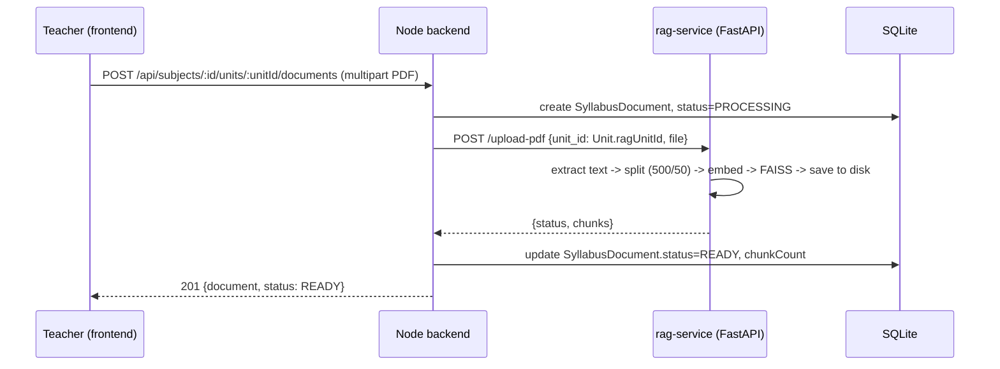

# NeuroLearn — Comprehensive Extension Plan

**Status: planning only.** Nothing in this document has been implemented. It is grounded in a full
read of the existing codebase, not assumptions — every claim in Part 1 was verified against the
actual source files, and every gap is called out explicitly rather than glossed over.

---

## Part 0 — Read this first: what "existing 10-minute demo" actually means in code

Before any new feature is designed, the single most important finding from inspecting this repo:

> **The adaptive quiz experience is real and reasonably sophisticated. The persistence of its
> results is not connected to it at all.** The quiz runs entirely in the browser, talks to the CV
> service directly, and then throws its own data away.

Specifically, verified by reading the code line by line:

1. **`QuizPage.tsx` never calls the backend.** It has its own hardcoded 20-question array, its own
   client-side adaptive-mode algorithm (`pickBestMode`, per-mode engagement totals with
   samples/focused-samples), and calls the CV service directly at `/analyze-frame`. It does **not**
   call any of `/api/quiz/start`, `/api/quiz/answer`, `/api/quiz/engagement`, `/api/quiz/complete`.
   Those four backend routes exist, are wired, and are **dead code** — nothing in the running app
   reaches them.
2. **The timer is 900 seconds (15 minutes), not 10.** `const [timeLeft, setTimeLeft] = useState(900)`.
   The "10-minute demo" in your brief and the actual constant disagree; flagging rather than
   silently picking one.
3. **`QuizResultPage.tsx` renders hardcoded mock numbers.** `const profile = { text: 68, audio: 82,
   visual: 95, recommended: 'VISUAL' }` — a literal constant, unconditional. The only real data
   that reaches this page is `score` and `total`, passed through router state. The rich
   `modeEngagement` object built during the quiz (per-mode score totals, sample counts, focused-frame
   counts) is computed, used live for adaptation, and then **discarded** when the quiz ends — never
   sent to the result page, never sent to the backend, never saved anywhere.
4. **No `DemoResult` row is ever created from a real quiz run.** `DemoResult` is `@unique` on
   `userId` (one row per user, overwritten on retake by design) — but since `/quiz/complete` is never
   called, no row is created by the actual product flow at all. `GET /quiz/result` will
   lazily create an empty default row on first read, which is the only reason the field isn't simply
   null.
5. **`DashboardPage.tsx` and `AdminPage.tsx` make zero API calls.** Both are polished, fully
   built UI shells (real charts, real layout, the existing dark/violet/amber theme) with **no data
   fetching at all** — everything on screen is static JSX.
6. **AR mode is not reachable from the adaptive quiz.** The client-side algorithm cycles
   `TEXT → AUDIO → VISUAL` only. `AR` exists as an enum value, as `DemoResult.arRecommended`
   (a boolean, unused by anything that sets it meaningfully), and as a separate always-static
   `/ar-game` page (A-Frame, loaded via CDN scripts, not integrated with quiz/session data).
7. **Role model is `USER | ADMIN` only.** No `TEACHER`. No `STUDENT` (everyone who registers is
   `USER`). No approval/verification fields on `User` at all.
8. **No `Classroom` model, no join-request model, no `Subject`/`Unit`/`Document` model** exist
   anywhere in the schema. There is a generic `LearningMaterial` model (subject/type/content
   JSON/learningMode) with admin CRUD routes, but it is not read by any student-facing route.
9. **Database is SQLite in practice** (`schema.prisma` → `provider = "sqlite"`, and
   `backend/prisma/dev.db` exists), while `backend/.env.example` documents a Postgres connection
   string. This is a real mismatch and matters for Part 7 (vector storage options).
10. **A standalone `rag-service/`** (FastAPI, port 8100, PDF → chunks → FAISS → retrieval →
    `gpt-4o-mini` tutorial generation, mode-aware output, offline fallback with no API key) was built
    in a prior session as an unconnected microservice. It has no auth, no link to any `Subject`/`Unit`
    row, and is not in `docker-compose.yml`. It is a strong starting point for Part 7, not a finished
    integration.

None of this is a criticism of the existing work — the CV-driven adaptive quiz UI, the theming, and
the RAG microservice are all genuinely good building blocks. But "integrate with the existing
10-minute demo" has to mean **first closing the gap between what the quiz measures and what gets
saved**, because every downstream feature you asked for — classroom recommendation, teacher review of
a student's profile, retake history, adaptive tutorials — depends on that data existing in the
database at all. That work is Phase 3 below, and it comes before anything classroom- or RAG-related.

---

## Part 1 — Current architecture (verified)

```
Hackathon-2026/
├── backend/          Node 18+ · Express 5 · Prisma 6 · SQLite (dev.db)   :5000/5001*
├── frontend/         React 18 · Vite · TypeScript · Tailwind · Framer Motion   :5173
├── cv-service/       Python · FastAPI · OpenCV (Haar cascades)   :8000
├── rag-service/      Python · FastAPI · FAISS · LangChain (built, unconnected)   :8100
├── ar-game/          Static A-Frame/WebXR HTML, CDN-loaded, no backend link
└── docker-compose.yml   wires db + backend + cv-service + frontend (not rag-service)
```
\* `backend/.env.example` says `PORT=5000`; `index.ts` defaults to `5001` if unset. Another small
doc/code mismatch, noted so nobody chases a phantom bug.

**Auth.** JWT (`jsonwebtoken`), `bcryptjs` for hashing, 7-day expiry by default, `Authorization:
Bearer` header, `requireAuth` middleware attaches `req.user` (password stripped) from a DB lookup on
every request — no session/refresh-token layer. `requireAdmin` middleware checks `role === 'ADMIN'`.
Frontend `AuthContext` stores the token in `localStorage`, loads `/auth/me` on mount, axios
interceptor attaches the bearer token and force-logs-out on any 401.

**Design system (to be reused, not replaced).** Dark theme: `--dark #0a0a0f`, `--dark-card #111120`,
`--dark-border #1e1e3a`, primary violet `#6C3DE7`, accent amber `#F59E0B`, `Inter` body / `Outfit`
display font, glassmorphism utility classes (`glass`, `glass-strong`), Framer Motion page transitions,
`lucide-react` icons, `recharts` for charts. Shared components already exist:
`components/ui/{Button,Input,Modal,LoadingSpinner}.tsx`, `components/Navbar.tsx`.

**CV service** (`cv-service/main.py`, 245 lines, verified in full): stateless per-frame Haar-cascade
face + eye detection, heuristic gaze bucket (`forward/left/right/up/down/away`) from face-box position,
a scored `engagement_score` (0–100, rule-based: base 70, +20 forward gaze, −20 away, −15 large yaw,
−10 large pitch, −5 on blink), in-memory per-`session_id` blink history (not persisted, resets on
service restart). One endpoint that matters: `POST /analyze-frame`. This is genuinely reusable as-is
for both the demo assessment and any future in-tutorial engagement checks.

---

## Part 2 — Current database models (verified against `schema.prisma`)

| Model | Real shape | Note |
| --- | --- | --- |
| `User` | id, name, email, password, `role: USER\|ADMIN`, rememberMe, resetToken(+Exp), timestamps | No teacher/approval/classroom fields |
| `DemoResult` | **1:1** with User (`userId @unique`) | Overwritten on every completion — no history today, and unreachable from the real UI besides the lazy-create on `GET /result` |
| `Subscription` | 1:1 with User, eSewa fields, plan/status enums | Unrelated to this plan; leave untouched |
| `QuizQuestion` | subject, question, options(Json), answer, imageUrl?, audioText?, learningMode, difficulty, ageGroup | Seeded (30 rows: 10/10/10 across modes) but not read by the real quiz — `QuizPage.tsx` uses its own 20-item hardcoded array instead |
| `LearningMaterial` | title, subject, type, content(Json), learningMode | Admin CRUD only; nothing student-facing reads it |
| `QuizSession` | userId, currentMode, questionIndex, score, engagementLog(Json), completed | Model and routes exist and are correct-looking; simply never invoked by the frontend |

**Enums:** `Role {USER, ADMIN}` · `LearningMode {TEXT, AUDIO, VISUAL, AR}` · `SubscriptionPlan` ·
`PaymentStatus`.

---

## Part 3 — Current workflows, as they actually run today

**Student (only role that meaningfully exists today).** Register/login → optional `/consent` camera
permission screen → `/quiz`: 15-minute, 20-question, client-side-only adaptive assessment with live
webcam engagement scoring → `/quiz/result`: **mock** engagement breakdown + real score → static
`/dashboard` → optional static `/ar-game`.

**Teacher.** Does not exist as a concept anywhere in the code — no role, no route guard, no page, no
model field.

**Admin.** Can log in and reach `/admin` (route-guarded correctly), but the page displays nothing
live — no user list, question list, or payment list is ever fetched, despite the matching backend
routes (`admin.ts`) being fully implemented and correct. This is the cheapest possible win in Phase 1:
wiring an already-good backend to an already-good frontend shell.

**Classroom.** Does not exist in any form — no model, no route, no page.

**RAG / syllabus.** Does not exist inside `Hackathon-2026/` proper. Exists only as the standalone,
unconnected `rag-service/` microservice from a prior session.

---

## Part 4 — Design: roles and approval

### 4.1 Schema additions

```prisma
enum Role {
  ADMIN
  TEACHER
  STUDENT
}

enum TeacherStatus {
  PENDING
  APPROVED
  REJECTED
  SUSPENDED
}

model User {
  // ...existing fields unchanged...
  role            Role           @default(STUDENT)   // BREAKING: was USER default — see 4.2
  teacherStatus   TeacherStatus?                       // set only when role == TEACHER
  teacherNote     String?                               // admin's reason on reject/suspend
  classroomTaught Classroom?     @relation("TeacherClassroom")
  enrolments      Enrolment[]
  joinRequests    ClassroomJoinRequest[]
  assessments     AssessmentAttempt[]
}
```

### 4.2 The `USER` → `STUDENT` migration is not free

Existing seeded/created rows have `role = USER`. A Prisma migration must include a data-migration
step (`UPDATE User SET role = 'STUDENT' WHERE role = 'USER'`) run **before** the enum is narrowed, or
the migration fails on any non-empty database. Document this explicitly in the migration file's SQL,
don't rely on Prisma inferring it.

### 4.3 Registration flow

- `POST /auth/register` gains an optional `intendedRole: 'STUDENT' | 'TEACHER'` (default `STUDENT`).
- If `TEACHER`: create the user with `role: TEACHER, teacherStatus: PENDING`. Login still succeeds
  (so they get a token and can see *something*), but every teacher-only route additionally checks
  `teacherStatus === 'APPROVED'` and returns `403 { error: 'Pending admin approval' }` otherwise.
- Frontend: a `PendingApprovalPage` (or a state inside the teacher dashboard shell) shown whenever
  `user.role === 'TEACHER' && user.teacherStatus !== 'APPROVED'`. Reuses `glass-strong` card, an
  amber "pending" badge (the theme already has the amber accent for exactly this kind of state).

### 4.4 Admin teacher management

New route file `backend/src/routes/teachers.ts`, mounted at `/api/admin/teachers`, `requireAuth +
requireAdmin`:

| Method | Path | Does |
| --- | --- | --- |
| `POST` | `/` | Admin-creates a teacher directly: name, email, temp password, `teacherStatus: APPROVED` immediately (Option A from the brief) |
| `GET` | `/` | List teachers, filterable by `?status=PENDING` |
| `PATCH` | `/:id/approve` | `teacherStatus → APPROVED` |
| `PATCH` | `/:id/reject` | `teacherStatus → REJECTED`, body carries `teacherNote` |
| `PATCH` | `/:id/suspend` | `teacherStatus → SUSPENDED` (post-approval revocation) |

Frontend: extend the existing `AdminPage.tsx` tab set (it already has an `activeTab` state machine
and a tab bar — this is additive, not a redesign) with a **Teachers** tab: a table (reuse the pattern
implied by the existing `Users`/`Questions` tabs once those are wired in Phase 1), a pending-count
badge, Approve/Reject buttons opening the existing `Modal` component for the rejection note.

### 4.5 Authorization middleware additions

```ts
// backend/src/middleware/auth.ts — additive
export const requireRole = (...roles: Role[]) => (req, res, next) => {
  if (!req.user) return res.status(401).json({ error: 'Authentication required' });
  if (!roles.includes(req.user.role)) return res.status(403).json({ error: 'Forbidden' });
  next();
};

export const requireApprovedTeacher = (req, res, next) => {
  if (req.user?.role !== 'TEACHER') return res.status(403).json({ error: 'Teacher access required' });
  if (req.user.teacherStatus !== 'APPROVED') {
    return res.status(403).json({ error: 'Teacher account pending approval' });
  }
  next();
};
```

`requireAdmin` stays as-is (kept for backward compatibility with the already-working `admin.ts`
routes); new code uses `requireRole('ADMIN')` going forward for consistency.

---

## Part 5 — Design: the classroom system

### 5.1 Scope decision (per your brief): one teacher → one classroom, for now

Modelled as a **1:1**, but with a shape that survives moving to 1:many later without a breaking
schema change — the FK direction (`Classroom.teacherId`) already supports multiple classrooms per
teacher; today's constraint is enforced with a `@unique` on `teacherId`, which is the one line to
remove when this graduates.

```prisma
model Classroom {
  id                String       @id @default(cuid())
  name              String
  description       String?
  teacherId         String       @unique          // remove @unique to allow many-per-teacher later
  teacher           User         @relation("TeacherClassroom", fields: [teacherId], references: [id])
  subjects          Subject[]
  admissionCriteria AdmissionCriteria?
  enrolments        Enrolment[]
  joinRequests      ClassroomJoinRequest[]
  createdAt         DateTime     @default(now())
  updatedAt         DateTime     @updatedAt
}

model Enrolment {
  id           String    @id @default(cuid())
  classroomId  String
  classroom    Classroom @relation(fields: [classroomId], references: [id], onDelete: Cascade)
  studentId    String
  student      User      @relation(fields: [studentId], references: [id], onDelete: Cascade)
  joinedAt     DateTime  @default(now())

  @@unique([classroomId, studentId])
}
```

### 5.2 Admission criteria — using real metrics, not invented ones

This directly answers your "adaptive classrooms based on learning behaviour, not just grade" ask. The
metrics used are **exactly** the ones the assessment (once fixed, Part 6) actually produces —
nothing new is invented:

```prisma
model AdmissionCriteria {
  id                 String    @id @default(cuid())
  classroomId        String    @unique
  classroom          Classroom @relation(fields: [classroomId], references: [id], onDelete: Cascade)

  // ranges, all optional - null means "no constraint on this axis"
  minTextEngagement    Float?
  maxTextEngagement    Float?
  minAudioEngagement   Float?
  maxAudioEngagement   Float?
  minVisualEngagement  Float?
  maxVisualEngagement  Float?
  preferredModes        Json?    // e.g. ["VISUAL", "AUDIO"] - subset match
  minAttentionSpanScore Float?   // derived metric, see 5.3
  maxAttentionSpanScore Float?
  minScorePercent       Float?   // assessment correctness
  maxScorePercent        Float?
  arRecommendedOnly      Boolean? // classroom specifically for AR-track learners

  updatedAt DateTime @updatedAt
}
```

### 5.3 Deriving "attention span" from data that already exists

The CV engagement log already gives us, per completed attempt: total samples, focused-sample count,
and (once Part 6 lands) per-mode breakdowns. Rather than inventing a new metric out of thin air:

```
attentionSpanScore = focusedSamples / totalSamples * 100         (0-100, higher = sustains focus longer)
adaptationCount     = number of mode-switches triggered during the attempt   (lower = more stable)
```

Both come straight out of the `engagementLog` JSON already being built by the (currently
disconnected) `modeEngagement` tracker in `QuizPage.tsx` — Part 6 is what makes this data reach the
database at all; this section only defines how to read it back out for matching.

### 5.4 Classroom matching — a scoring function, not a black box

Deliberately simple and explainable, because the brief explicitly asks the student to see **why** a
classroom was recommended:

```ts
function scoreClassroomMatch(profile: StudentProfile, criteria: AdmissionCriteria): MatchResult {
  const checks: { label: string; passed: boolean; weight: number }[] = [
    inRange('Text engagement', profile.textEngagement, criteria.minTextEngagement, criteria.maxTextEngagement, 1),
    inRange('Audio engagement', profile.audioEngagement, criteria.minAudioEngagement, criteria.maxAudioEngagement, 1),
    inRange('Visual engagement', profile.visualEngagement, criteria.minVisualEngagement, criteria.maxVisualEngagement, 1),
    inRange('Attention span', profile.attentionSpanScore, criteria.minAttentionSpanScore, criteria.maxAttentionSpanScore, 1.5),
    inRange('Assessment score', profile.scorePercent, criteria.minScorePercent, criteria.maxScorePercent, 1),
    modeOverlap(profile.preferredMode, criteria.preferredModes, 1),
  ].filter(c => c.applicable); // null bounds on the criteria side = not applicable, not a fail

  const score = weightedPercent(checks);
  return { classroomId, score, reasons: checks }; // reasons feed the "why" explanation directly
}
```

Run across every classroom, sorted by `score` descending. The **top match's `reasons` array is
rendered directly** as the human-readable explanation — no separate copy-writing needed, no
hallucinated justification. If there is only one classroom (the common case at hackathon scale), this
degrades gracefully to "here is how well you fit it" rather than a false choice.

### 5.5 Join request flow

```prisma
enum JoinRequestStatus {
  PENDING
  APPROVED
  REJECTED
}

model ClassroomJoinRequest {
  id            String            @id @default(cuid())
  classroomId   String
  classroom     Classroom         @relation(fields: [classroomId], references: [id], onDelete: Cascade)
  studentId     String
  student       User              @relation(fields: [studentId], references: [id], onDelete: Cascade)
  matchScore    Float             // snapshot at request time - the number shown to the teacher
  matchReasons  Json              // snapshot of the `reasons` array from 5.4, for teacher review
  status        JoinRequestStatus @default(PENDING)
  teacherNote   String?
  requestedAt   DateTime          @default(now())
  decidedAt     DateTime?

  @@unique([classroomId, studentId])
}
```

Approving a request creates the `Enrolment` row and marks the request `APPROVED` in one transaction;
rejecting just updates status + note. The **snapshot** fields (`matchScore`, `matchReasons`) matter:
a student's profile can change between requesting and the teacher reviewing (Part 6 retakes), and the
teacher should see what was true *when the student asked*, with the option to view the *current*
profile alongside it (an extra API call, not a schema requirement).

---

## Part 6 — Design: fixing and extending the assessment (the load-bearing phase)

This is the highest-priority implementation phase, because Parts 5, 7 and 8 all read from data this
phase is responsible for actually persisting.

### 6.1 What changes in `QuizPage.tsx`

Minimal, additive changes — the adaptive algorithm, CV integration, and UI are kept exactly as they
are (they work well):

1. On mount, `POST /api/assessments/start` → returns an `attemptId`. Store in a ref, alongside the
   existing `sessionIdRef`.
2. On each `handleAnswer`, fire-and-forget `POST /api/assessments/:id/answer` with
   `{questionId, answer, correct, mode, timestamp}` — additive to the existing local state updates,
   not a replacement.
3. Periodically (e.g. every 5th CV sample, to avoid hammering the API at 4 req/sec) sync
   `modeEngagement` snapshots via `POST /api/assessments/:id/engagement`.
4. On completion (timer expiry or all questions exhausted), instead of only `navigate('/quiz/result',
   {state: {score, total}})`, first `POST /api/assessments/:id/complete` with the **full**
   `modeEngagement` object, then navigate with the *server's computed* profile in state (so the
   result page has real numbers immediately, no extra round trip, and also has them in the DB for
   Part 5/8 to read later).

### 6.2 Schema: attempts, not upserts — this is the retake requirement

`DemoResult` (1:1, overwritten) is replaced in the write path by a proper history table.
`DemoResult` itself can stay as a "cached latest" convenience table (cheap to keep, other code may
still read it), but the **source of truth becomes `AssessmentAttempt`**:

```prisma
model AssessmentAttempt {
  id                String       @id @default(cuid())
  userId            String
  user              User         @relation(fields: [userId], references: [id], onDelete: Cascade)

  textEngagement    Float
  audioEngagement   Float
  visualEngagement  Float
  attentionSpanScore Float        // focusedSamples / totalSamples * 100, see 5.3
  adaptationCount    Int          // number of mode-switches during this attempt
  preferredMode      LearningMode
  arRecommended      Boolean
  scoreCorrect       Int
  scoreTotal         Int
  scorePercent       Float

  engagementLog      Json          // full raw log, for audit/debugging/future re-analysis
  startedAt          DateTime      @default(now())
  completedAt         DateTime?
  durationSeconds      Int?

  @@index([userId, completedAt])
}
```

`GET /api/assessments/history` → all attempts for the current user, `completedAt desc`. The frontend
result page and a new "My Progress" panel both read from this — real trend data (`previousScore →
latestScore`, a small `recharts` line, exactly the charting library already in the dependency tree).

### 6.3 Retake flow

- `POST /api/assessments/start` is idempotent-safe: if an incomplete attempt already exists for this
  user, resume it (mirrors the existing, correct pattern in `quiz.ts`'s dead `/start` route — that
  logic gets reused, not reinvented); otherwise create a fresh `AssessmentAttempt`.
- No attempt is ever deleted. "Retake" is simply calling `/start` again after a `completedAt` is set.
- The classroom-recommendation call (Part 5.4) always reads the **latest completed** attempt.
- If a student is already enrolled and retakes, their `Enrolment` is untouched (retaking doesn't
  auto-transfer them) — but the dashboard shows "your profile has changed since joining, [view updated
  recommendation]" as a soft nudge, not an automatic action.

### 6.4 Fixing `QuizResultPage.tsx`

Replace the hardcoded `profile` constant with the attempt object returned by `/complete` (or fetched
via `GET /api/assessments/:id` if arriving via a page refresh / deep link). Same visual design
(`recharts`-driven bars, the "Recommended Approach" panel) — only the data source changes from a
literal to a prop/API response. This section of the page becomes the natural place to surface the
classroom recommendation (Part 5.4) once it exists.

---

## Part 7 — Design: RAG, subjects, units, and syllabus ingestion

### 7.1 Where the existing `rag-service/` fits

Keep it as the microservice that does PDF-processing + embeddings + generation — that part is built,
tested (24/24 checks), and works with or without an `OPENAI_API_KEY` present. What's missing is the
**database-of-record layer**: today the service tracks "units" only as filesystem folders
(`vector_store/index_unit_{id}`) with no ownership, no classroom scoping, no subject/unit hierarchy.
This phase adds that layer in the Node backend (consistent with how `cv-service` is only ever called
*through* the Node backend today, never directly from privileged frontend code) and teaches
`rag-service` to accept a `unit_id` that the Node backend controls.

### 7.2 Schema

```prisma
model Subject {
  id           String     @id @default(cuid())
  classroomId  String
  classroom    Classroom  @relation(fields: [classroomId], references: [id], onDelete: Cascade)
  name         String                              // "Mathematics"
  units        Unit[]
  createdAt    DateTime   @default(now())
}

model Unit {
  id           String     @id @default(cuid())
  subjectId    String
  subject      Subject    @relation(fields: [subjectId], references: [id], onDelete: Cascade)
  title        String                              // "Unit 1 - Algebra"
  order        Int        @default(0)
  documents    SyllabusDocument[]
  tutorials    Tutorial[]
  ragUnitId    Int?       @unique                    // the integer id rag-service indexes under
  indexStatus  IndexStatus @default(NOT_INDEXED)
  createdAt    DateTime   @default(now())
}

enum IndexStatus {
  NOT_INDEXED
  PROCESSING
  READY
  FAILED
}

model SyllabusDocument {
  id           String   @id @default(cuid())
  unitId       String
  unit         Unit     @relation(fields: [unitId], references: [id], onDelete: Cascade)
  uploadedById String
  uploadedBy   User     @relation(fields: [uploadedById], references: [id])
  filename     String
  fileType     String                                // pdf | docx | txt
  storagePath  String                                // where the Node backend saved the original
  pageCount    Int?
  chunkCount   Int?
  status       IndexStatus @default(NOT_INDEXED)
  errorMessage String?
  uploadedAt   DateTime @default(now())
}
```

Node owns the metadata (who uploaded what, into which unit, current status); `rag-service` owns the
heavy lifting (extraction, chunking, embeddings, the FAISS index on disk). The Node backend is the
**only** thing the frontend or auth system ever talks to — `rag-service` becomes an internal-only
service the same way `cv-service` already is (not exposed publicly in `docker-compose.yml` beyond the
internal network, `RAG_SERVICE_URL` env var mirroring the existing `CV_SERVICE_URL` pattern exactly).

### 7.3 Ingestion sequence



Failure paths (from the already-implemented `rag-service` error handling, reused as-is): non-PDF →
400 before any DB row is even marked processing; scanned PDF with no text layer → 400 with the exact
existing message ("needs OCR"); `rag-service` unreachable → Node catches the network error, marks
`SyllabusDocument.status = FAILED, errorMessage`, returns 502 to the teacher rather than hanging.

### 7.4 Vector storage decision

**Keep FAISS-on-disk from the existing `rag-service`, do not introduce a vector database.** Reasoning,
explicit per your instruction not to over-engineer:

- The live database is SQLite (Part 0, finding 9) — adding Postgres + pgvector purely for this
  feature is a heavier infra change than the hackathon scope justifies, and would also mean running
  two databases.
- FAISS-per-unit already works, is already tested, and the index sizes here (a handful of PDFs) are
  nowhere near where FAISS's simplicity becomes a bottleneck.
- If this graduates past a hackathon: Postgres + `pgvector` is the natural next step, and nothing in
  this design blocks it — `SyllabusDocument`/`Unit` already model the metadata independently of where
  vectors live.

---

## Part 8 — Design: AI tutorial generation, grounded and leveled

### 8.1 The generation pipeline, extended from what `rag-service` already does

`rag-service`'s `/generate-tutorial` already does retrieval-augmented generation scoped to one unit
and one `learning_mode`. This phase adds two axes on top, both **grounded in data that exists**:

1. **Level**, derived from the student's latest `AssessmentAttempt.scorePercent` (not invented):
   `<40% → Level 1`, `40–60% → Level 2`, `60–80% → Level 3`, `>80% → Level 4`. Configurable
   thresholds, stored as constants, not hardcoded per-call.
2. **Modality mix**, derived from `preferredMode` / per-mode engagement split, feeding the existing
   `learning_mode` parameter `rag-service` already accepts — no new parameter needed there, just a
   Node-side decision of *which* mode to request (and the option to request more than one and let the
   student pick, matching your "multimodal" ask without inventing a new endpoint).

```prisma
model Tutorial {
  id            String       @id @default(cuid())
  unitId        String
  unit          Unit         @relation(fields: [unitId], references: [id], onDelete: Cascade)
  studentId     String
  student       User         @relation(fields: [studentId], references: [id])
  learningMode  LearningMode
  level         Int                                   // 1-4, from 8.1
  tutorialText  String
  audioScript   String
  visualSuggestion String
  quiz          Json                                  // [{question, options, correct}]
  teacherNote   String
  sourceChunks  Int
  offline       Boolean      @default(false)           // true if built without an OpenAI key - shown in UI
  createdAt     DateTime     @default(now())

  @@index([studentId, unitId])
}
```

Tutorials are **cached, not regenerated on every view** — `Tutorial` rows are looked up by
`(studentId, unitId, learningMode, level)` before calling `rag-service` again, both for cost control
and so a student re-opening a lesson gets a stable experience rather than a re-rolled one.

### 8.2 Structuring the output into lesson steps

The brief asks for `Unit → Topic → Concept → Tutorial → Steps → Examples → Activity → Quiz →
Feedback`. Rather than a second AI call to "expand" the existing JSON (extra cost, extra place to
hallucinate), extend `rag-service`'s existing `SYSTEM_PROMPT` to return **structured steps directly**:

```jsonc
{
  "tutorial_text": "...",          // kept, for backward compatibility with the AdaptiLearn demo
  "steps": [
    { "concept": "...", "explanation": "...", "example": "...", "checkpoint_question": "..." }
  ],
  "audio_script": "...",
  "visual_suggestion": "...",
  "quiz": [...],
  "teacher_note": "..."
}
```

One additive field (`steps`), one prompt change in `rag-service/app/rag_engine.py`'s
`SYSTEM_PROMPT` — not a rewrite of the generation pipeline, and the offline fallback (Part 0, finding
10) is extended the same way: extractive step-splitting on sentence boundaries, same honesty
guarantee (`"offline": true`) it already has.

### 8.3 Anti-hallucination, concretely

Already true of the existing implementation and preserved: the prompt only ever receives the top-k
**retrieved** chunks as context, never the full document, and is explicitly instructed to answer only
from what's given. The one addition worth making: if `source_chunks === 0` for a requested
mode/level, **refuse to generate** and surface "no content available for this unit yet" rather than
letting the model free-associate from its own training data — a one-line guard in
`generate_tutorial()`.

---

## Part 9 — Design: adaptive UI and gamification

### 9.1 Adaptive presentation — reusing existing signal, not new tracking

The `Tutorial.level` and `Tutorial.learningMode` (Part 8.1) already carry everything needed to decide
layout, without any new metrics:

| Signal (already computed) | UI decision |
| --- | --- |
| `learningMode === VISUAL` | Lead with `visual_suggestion` rendered as a diagram/image card first |
| `learningMode === AUDIO` | Auto-play `audio_script` via the browser's own `speechSynthesis` (already used in `QuizPage.tsx` — same `synth.speak` pattern, reused) |
| `level <= 2` | Larger type, shorter `steps` shown one at a time with a "Next" tap, hint text visible by default |
| `level >= 3` | Denser layout, all steps visible, hints collapsed behind a toggle |
| `attentionSpanScore` low (Part 5.3) | Shorter step segments, a visible progress ring, more frequent micro-rewards (9.2) |

### 9.2 Gamification — scoped to what's demoable, not a shallow feature list

Kept deliberately small and load-bearing rather than a long unfocused list, per your instruction to
prioritize polish over breadth:

```prisma
model StudentProgress {
  id             String   @id @default(cuid())
  studentId      String   @unique
  student        User     @relation(fields: [studentId], references: [id])
  xp             Int      @default(0)
  streakDays     Int      @default(0)
  lastActiveDate DateTime?
  badges         Json     @default("[]")     // [{id, name, earnedAt}]
}
```

- **XP**: awarded on tutorial-quiz completion and on assessment completion — both events already
  exist as API calls in this plan (8.1's cached-tutorial view, 6.1's `/complete`), so XP is a side
  effect of an endpoint that already has to run, not a new tracking surface.
- **Streak**: a date-diff check on `lastActiveDate`, updated on any completion event.
- **Badges**: a small fixed set tied to concrete milestones ("first tutorial completed", "3-day
  streak", "leveled up") — a lookup table in code, not a new model, evaluated after each XP award.
- Rendered with `framer-motion` (already a dependency) for the reveal animation, matching the existing
  polish level of `QuizResultPage.tsx`'s trophy reveal.

Explicitly **not** building in this pass (would dilute the core loop): a full achievements gallery
page, leaderboards, or unlockable cosmetics — noted in Part 15 as future work, not because they're bad
ideas but because the brief asks for a polished core over a wide shallow feature set.

---

## Part 10 — Frontend: new pages and components

| Page | Route | Guard | Reuses |
| --- | --- | --- | --- |
| `TeacherPendingPage.tsx` | shown inline when `teacherStatus !== APPROVED` | authenticated teacher | `glass-strong`, amber badge pattern |
| `TeacherDashboardPage.tsx` | `/teacher` | approved teacher | `DashboardPage.tsx` layout, `recharts` |
| `ClassroomSetupPage.tsx` | `/teacher/classroom` | approved teacher | `Modal`, `Input`, `Button` |
| `AdmissionCriteriaPage.tsx` | `/teacher/classroom/criteria` | approved teacher | form patterns from `AdminPage.tsx` |
| `SubjectManagerPage.tsx` | `/teacher/subjects` | approved teacher | — |
| `DocumentUploadPage.tsx` | `/teacher/subjects/:id/units/:unitId` | approved teacher | file-drop UI, new |
| `JoinRequestsPage.tsx` | `/teacher/requests` | approved teacher | `Modal` for review |
| `ClassroomRecommendationPage.tsx` | `/recommendation` | student, post-assessment | `QuizResultPage.tsx`'s "Recommended" panel pattern, generalized |
| `MyClassroomPage.tsx` | `/classroom` | enrolled student | — |
| `TutorialPage.tsx` | `/classroom/units/:unitId/tutorial` | enrolled student | adaptive rendering per 9.1 |
| `ProgressHistoryPage.tsx` | `/progress` | student | `recharts` line chart, reuses `AssessmentAttempt` history |
| Admin: **Teachers tab** | inside existing `AdminPage.tsx` | admin | existing tab-bar pattern |

New shared components: `MatchScoreCard.tsx` (renders a `MatchResult` from 5.4 — score + reasons list,
used on both the student recommendation page and the teacher's join-request review), `XPBar.tsx`,
`BadgeToast.tsx`, `LevelIndicator.tsx`, `DocumentDropzone.tsx`.

---

## Part 11 — Backend: new route files

| File | Mounted at | Key endpoints |
| --- | --- | --- |
| `routes/teachers.ts` | `/api/admin/teachers` | create/list/approve/reject/suspend (Part 4.4) |
| `routes/classrooms.ts` | `/api/classrooms` | create (teacher, once), get mine, update criteria |
| `routes/joinRequests.ts` | `/api/classrooms/:id/requests` | student: create; teacher: list/approve/reject |
| `routes/assessments.ts` | `/api/assessments` | start/answer/engagement/complete/history (Part 6) — supersedes the dead `quiz.ts` write path |
| `routes/recommendations.ts` | `/api/recommendations` | `GET /` → ranked classroom matches for the current student (Part 5.4) |
| `routes/subjects.ts` | `/api/classrooms/:id/subjects` | CRUD subjects + nested units |
| `routes/documents.ts` | `/api/units/:id/documents` | upload (proxies to `rag-service`), list, delete |
| `routes/tutorials.ts` | `/api/units/:id/tutorial` | `GET` (cached lookup or generate, Part 8.1) |
| `routes/progress.ts` | `/api/progress` | XP/streak/badges read + internal award function used by other routes |

`quiz.ts` is **kept, not deleted** (still reachable, still harmless) but the frontend stops needing
it; a follow-up cleanup can remove it once `assessments.ts` is confirmed to fully replace it in
practice.

---

## Part 12 — Security considerations

- **Role checks on every new route**, via `requireRole`/`requireApprovedTeacher` (Part 4.5) — never
  trust a frontend route guard alone; every list above states its guard explicitly so nothing ships
  ungated.
- **Ownership checks, not just role checks.** A `TEACHER` role is necessary but not sufficient — e.g.
  `PATCH /api/classrooms/:id/criteria` must additionally verify `classroom.teacherId === req.user.id`,
  or any approved teacher could edit another's classroom.
- **File upload validation** in `routes/documents.ts`: MIME-type allowlist (pdf/docx/txt), a size cap
  before the buffer ever reaches `rag-service`, and the upload path scoped so a teacher can only
  upload into a unit that belongs to their own classroom's subject.
- **`rag-service` becomes internal-only.** Not exposed on a public port in production compose; only
  reachable from the Node backend's network, exactly like `cv-service` today. The frontend never talks
  to it directly.
- **API keys never reach the frontend.** `OPENAI_API_KEY` lives only in `rag-service`'s `.env`,
  exactly as already built — nothing in this plan changes that boundary.
- **The offline fallback is a security-adjacent feature, not just a UX one**: it means a missing or
  revoked API key degrades gracefully instead of the tutorial endpoint failing open or exposing an
  error with implementation detail to the student.
- **`teacherNote`/rejection reasons and `matchReasons`** are visible only to the teacher and the
  student they're about, never listable across users — standard row-level `where: {userId: req.user.id}`
  scoping on every read.

---

## Part 13 — Implementation phases (mapped 1:1 to your Phase 1–12 list)

| Phase | Scope | Depends on |
| --- | --- | --- |
| **1** | Roles (`STUDENT/TEACHER/ADMIN`), teacher self-register + admin-create, approval workflow, `requireRole`/`requireApprovedTeacher`, wire the already-built `AdminPage.tsx` to the already-built `admin.ts` (cheap, high-visible win) | Part 4 |
| **2** | `Classroom`, `AdmissionCriteria`, teacher dashboard shell, subject/unit CRUD skeleton (no documents yet) | Phase 1, Part 5 |
| **3** | **Close the assessment-persistence gap** (Part 6): `AssessmentAttempt`, wire `QuizPage.tsx` to real endpoints, fix `QuizResultPage.tsx`'s hardcoded data | none — can start in parallel with Phase 1 |
| **4** | Retake history, "My Progress" trend view | Phase 3 |
| **5** | Classroom matching (5.4) + recommendation page + join-request flow + teacher review UI | Phases 2 & 3 |
| **6** | Wire `rag-service` into Node (`Subject/Unit/SyllabusDocument`, upload proxy, status tracking) | Phase 2, Part 7 |
| **7** | Tutorial generation endpoint, level derivation (8.1), structured steps (8.2) | Phases 3 & 6 |
| **8** | Multimodal presentation (9.1) — this is mostly frontend, reading fields Phase 7 already returns | Phase 7 |
| **9** | Gamification (`StudentProgress`, XP/streak/badges) | Phases 3 & 7 (hooks into their completion events) |
| **10** | UI/UX polish pass: loading/error/empty states across every new page, responsive check | all above |
| **11** | End-to-end manual test of the full 20-step demo story from your brief | all above |

This order deliberately puts **Phase 3 (fixing assessment persistence) early and independent**,
because it's the one piece every other phase's "use real metrics, not fake ones" requirement depends
on, and it can be built and verified in isolation before any classroom/RAG code exists.

---

## Part 14 — Testing strategy

- **Backend**: the existing `rag-service/smoke_test.py` pattern (FastAPI `TestClient`, no external
  API key required, asserts documented error shapes) is the model to follow for the new Node routes
  too — a lightweight request-level test per new route file, run against a throwaway SQLite file, not
  a mocked Prisma client, so migrations are exercised for real.
- **The USER→STUDENT migration** (Part 4.2) gets a dedicated test: seed a `USER`-role row against the
  *old* schema state, run the migration, assert it reads back as `STUDENT`.
- **Classroom matching (5.4)** is pure-function-testable: feed synthetic `AssessmentAttempt` +
  `AdmissionCriteria` combinations, assert the score and, importantly, that `reasons` never contains a
  criterion the classroom didn't actually set (no false justification).
- **RAG generation**: reuse `rag-service`'s existing 24-check suite unchanged; add Node-side
  integration tests that mock `rag-service`'s HTTP responses (both success and its documented error
  shapes) rather than requiring a live OpenAI key in CI.
- **Manual end-to-end pass**: the exact 20-step story in your brief, run once per phase group that
  completes it (e.g. after Phase 5, run steps 1–13; after Phase 9, run the full 1–20).

---

## Part 15 — Explicitly out of scope for this plan (future work)

- Multi-classroom-per-teacher (schema supports it per 5.1, not exposed in UI yet).
- A real vector database (Postgres/pgvector) — revisit only if FAISS-on-disk becomes a demonstrated
  bottleneck.
- DOCX/TXT ingestion — `rag-service` is PDF-only today; extending its extraction step to `python-docx`
  and plain text is a contained follow-up inside `rag_engine.py`, not a new architecture.
- Leaderboards, achievement galleries, unlockable cosmetics (Part 9.2).
- Touching `Subscription`/eSewa, `ar-game/`, or `cv-service/` beyond adding the one new
  `RAG_SERVICE_URL`-style env wiring — none of this plan's phases require changing them, and they are
  deliberately left alone.
- Removing the now-superseded `quiz.ts` routes — kept until `assessments.ts` is proven in practice.

---

## Part 16 — What this plan explicitly does NOT touch

Per your instruction to reuse rather than rewrite: `Subscription`/eSewa flow, `cv-service/main.py`
(used as-is via its one existing endpoint), the visual theme/design tokens, existing shared
`components/ui/*`, `ar-game/` (left as a standalone route, integration is future work per Part 15),
and `docker-compose.yml`'s existing four services (only additive: one new `rag-service` block,
following the exact pattern already used for `cv-service`).
